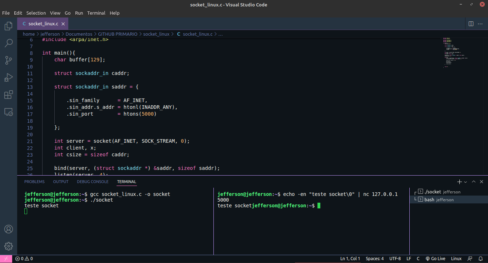

# <font color=#483D8B>Sockets Linux</font>

Existe diferença nas construções de sockets para cada SO. O Socket aqui construído e estudado trata-se de um socket para SO's Linux.

#

## Principais funções que podem ser utilizadas em um socket linux:

> - getaddrinfo( ) -> Traduz nomes para endereços sockets

> - socket()       -> Cria um socket e retorna o descritor de arquivo

> - bind()         -> Associa o socket a um endereço socket e uma porta

> - connect()      -> Tenta estabelecer uma conexão com um socket

> - listen()       -> Coloca o socket para aguardar conexões

> - accept()       -> Aceita uma nova conexão e cria um socket

> - send()         -> caso conectado, transmite mensagens ao socket

> - recv()         -> recebe as mensagens através do socket 

> - close()        -> desaloca o descritor de arquivo

> - shutdown()     -> desabilita a comunicação do socket

## Para cada função dessas citadas acima, utilize o comando "man" do linux. 

EXE.: <br>
`man listen`

#

# <font color=#483D8B>Características</font>

## <font color=#00FF00>struct sockaddr_in saddr</font>

É Nescessário que em uma determinada estrutura estejam contidas algumas definições segundo a opção do programador quanto a como ele irá querer utilizar o socket. Essas definições incluem tipo de família dos ip's a serem utilizados, tipo de configuração de rede, conversão de bytes, entre outros.

~~~C
    struct sockaddr_in saddr = {

        .sin_family      = AF_INET,
        .sin_addr.s_addr = htonl(INADDR_ANNY), 
        .sin_port        = htons(5000)

    };

~~~

- <font color=#8470FF>AF_INET</font> -> Define a Família IPV4

- <font color=#8470FF>htonl</font> -> "h"ost "to" "n"etwork "l"ong - host to network long (converte os bytes do host para os bytes de rede com dados de tamanho longo).

- <font color=#8470FF>INADDR_ANNY</font> -> víncula o socket a todas interfaces permitidas no host em uma comunicação.

- <font color=#8470FF>htons</font> -> "h"ost "to" "n"etwork "s"hort - host to network short (converte os bytes do host para os bytes de rede com dados de tamanho curto).
Essa função está sendo utilizada para definir o parâmetro .sin_port o qual define a porta a ser utilizada na comunicação, no nosso caso está sendo utilizada a porta "5000".


## <font color=#00FF00>while</font>

Como iremos trabalhar com uma comunicação via socket é necessária que nossa aplicação se mantenha rodando. Então devemos construir um while constante que finalize apenas com a opção de interrupção do usuário ou de outra aplicação. 

~~~C

    int server = socket(AF_INET, SOCK_STREAM, 0); 
    int client, x;
    int csize = sizeof caddr;

    bind(server, (struct sockaddr *) &saddr, sizeof saddr);
    listen(server, 4);

    while(1){
        client = accept(server, (struct sockaddr *) &saddr, &size);
        x = recv(client, buffer, sizeof buffer, 0);

        send(client, buffer, x, 0);

        puts(buffer);
        fflush(stdout);

        close(client);
    }

~~~

- <font color=#8470FF>int server</font> -> Iniciamos a variável `server` com a função socket, essa função será responsável por criar um socket. <br>
Para mais informações acerca do params da função cheque seu manual linux.

- <font color=#8470FF>bind()</font> -> função `bind` atribui o endereço especificado por saddr(a struct criada) ao soquete referido pelo server. Tradicionalmente, essa operação é chamada de “atribuir um nome a um soquete”. 

- <font color=#8470FF>client</font> -> Dentro do `while` definimos o cliente que irá fazer as requisições ao server. A váriável `client` recebe a função `accept`, essa função ficará responsável por aceitar uma nova conexão e criar um socket, por isso em um dos seus parâmetros ela recebe a váriável `server` que agrega a função `socket`.

- <font color=#8470FF>x</font> -> A variável x irá receber a função `recv` que se irá receber as mensagens através do socket.

- <font color=#8470FF>fflush()</font> -> Com um fluxo de dados trabalha no stdout com buffer, fazendo a limpeza do buffer quando encerrado o fluxo.

- <font color=#8470FF>close()</font> -> desaloca o/os descritor/es de arquivo/s abertos pelo socket client. 

#

# <font color=#483D8B>Utilizando</font>

Vamos utilizar a ferramenta NetCat para nos auxiliar na comunicação.

#

1. Compile o código utilizando o gcc:
```
gcc socket_linux.c -o socket
```

2. Execute o código:
```
./socket
```

3. deixe o socket sendo executado em um terminal e em outro terminal execute a mensagem de comunicação em conjunto com o netcat utilizando a porta que definimos no saddr:
```
echo -en "teste socket\0" | nc 127.0.0.1 5000
```

